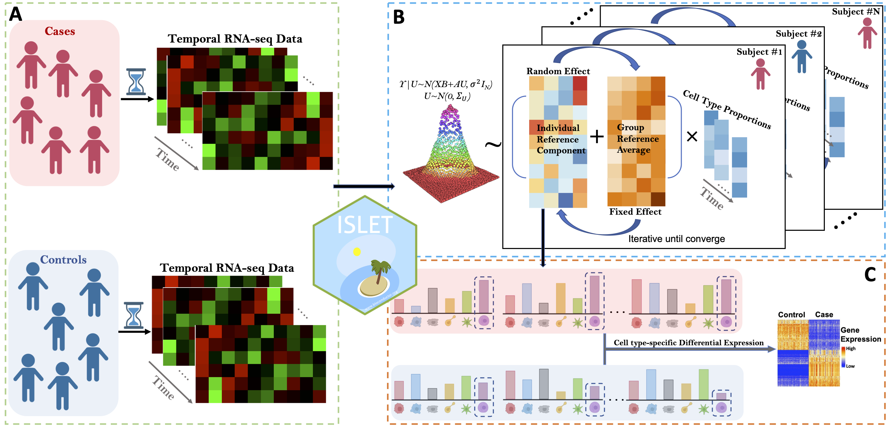

# ISLET
Individual-Specific ceLl typE referencing Tool 

-------------------
 We developed a method called `ISLET` (Individual-Specific ceLl typE referencing Tool), to deconvolute mixture samples and obtain the individual-specific and cell-type-specific reference panels. `ISLET` can leverage on multiple observations or temporal measurements of the same subject. `ISLET` adopted a more reasonable assumption that repeated samples from the same subject would share the same reference panel. This unknown panel, treated as missing values, are estimated by an iterative Expectation--Maximization (EM) algorithm in mixed-effect regression framework, when combining all samples from all subjects together. This is the first statistical framework to estimate the subject-level cell-type-specific reference panel, for repeated measures. Our modeling can effectively borrow information across samples within the same subject.

#### `ISLET` is currently being sumitted to 

# 1. Introduction
In clinical samples, the observed bulk sequencing/microarray data are often a mixture of different cell types. Because each unique cell type has its own gene expression profile, the real sequencing/microarray data are the weighted average of signals from multiple pure cell types. In high-throughput data analysis, the mixing proportions will confound with the primary phenotype-of-interest, if not properly accounted for. Over the past several years, researchers have gained substantial interests in using computational methods to deconvolute cell compositions. Under the assumption of a commonly shared feature-by-cell-type reference panel across all samples, deconvolution methods were developed. However, this assumption may not hold. For example, when repeated samples are measured for each subject, assuming a shared reference panel across different time points for each subject is a preferred choice over assuming a shared one across all the samples.

Here, we developed a method called `ISLET` (Individual-Specific ceLl typE referencing Tool), to deconvolute mixture samples and obtain the individual-specific and cell-type-specific reference panels. `ISLET` can leverage on multiple observations or temporal measurements of the same subject. `ISLET` adopted a more reasonable assumption that repeated samples from the same subject would share the same reference panel. This unknown panel, treated as missing values, are estimated by an iterative Expectation--Maximization (EM) algorithm in mixed-effect regression framework, when combining all samples from all subjects together. This is the first statistical framework to estimate the subject-level cell-type-specific reference panel, for repeated measures. Our modeling can effectively borrow information across samples within the same subject.

`ISLET` depends on the following packages:

-   `r Biocpkg("BiocParallel")`, for parallel computing implementation,
-   `r CRANpkg("Matrix")`, for large matrices operations in *R*.

# Preparing ISLET input files for deconvolution:
ISLET needs to have the feature by sample matrix for observed values, sample by cell type matrix for cell type proportions, and data frame showing the relationship between samples to subjects. The requirement is the same for both case group and control group, resulting to a total of 6 elements as the input. An example dataset `GE600` is included to show what is required:

